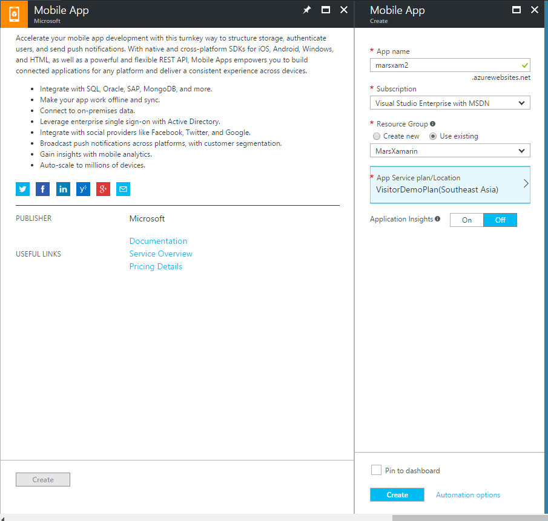
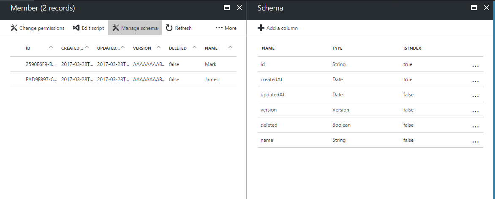
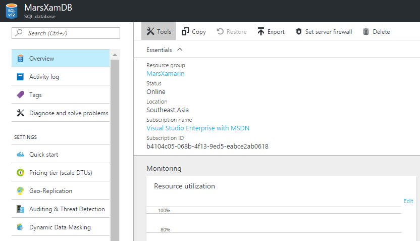

# Challenge 3: Member List

## Introduction
We need a way to keep track of the members on our team, let's make a database of our team members, as well as an interface to access it. This challenge will be guided for the most part.

In this challenge, we will use the Azure Mobile Apps backend and client SDK.

We will be creating a database table and API in the backend on Azure and then connecting to it using the SDK.

## Creating an Azure Mobile Apps instance
On the Azure Portal, click "New" on the left sidebar.

Search for "Mobile App" and create a new Mobile App. Feel free to use any name you wish.

After the resource has been deployed, click on it and go to "Easy Tables".

Create a new SQL database to connect to if you don't have one, check the box and click "Initialize App".

## Setting up the database

After you're done initializing the app, in the Easy Tables panel, click "Add Table" and create a new table called "Member".

Next, we have to modify the schema and add a new column called "name". This is the column we will use to store the name of our team members.

Let's add in a few rows of data so that we can retrieve it later from our Xamarin Forms application.

First, go back to the "All Resources" page on Azure and select the SQL database that you created for the mobile app previously.

Click on Tools at the top and click "Open in Visual Studio".

Now that you're in Visual Studio, you can connect to the database using your username/password. Right click on "dbo.Member" under tables and select "View Data".

Let's add some sample rows of data to the database. Put the team members' names into the "name" column and the other columns will autofill after pressing enter.

Done! Now we have a fully working database and API powered by Azure Mobile Apps.

## Connecting to Azure from Xamarin